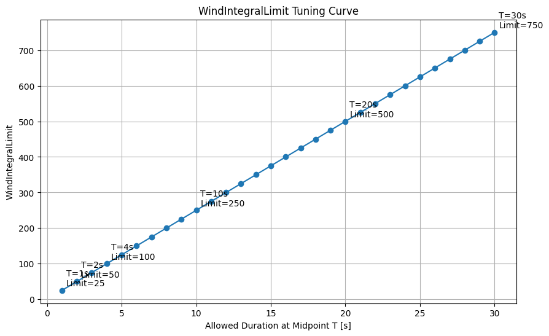

# Beyond Simple Wind Thresholds: A Practical Protection Algorithm for Awnings and Other Wind-Sensitive Systems


When it comes to awning control, there are two dominant challenges ---
quantities that can change quickly while also being highly relevant:

**wind and sunlight.**

Everything else, especially temperatures and blocking times, is usually
an additional parameter.

This article focuses on wind.

The approach presented here grew out of the development and extensive
real-world testing of my own motorized awning controller. This version
is the consolidated result after a detailed discussion in the Arduino
Forum. That discussion helped sharpen the interpretation of the
algorithm, identify edge cases, and distinguish the approach more
clearly from related filtering techniques.

This article is self-contained; no knowledge of that discussion is
required.

My controller uses a cup anemometer, with its rotational speed in RPM
sampled once per second, to protect the awning from wind damage.

> **Important:** The algorithm is independent of the unit used. RPM is
> used here because the reference implementation is based on a cup
> anemometer. The same approach works with wind-speed values such as
> m/s, km/h, mph or ft/s, provided all thresholds and limits are
> adjusted consistently.

The principle is also independent of the specific application. Although
this article uses a motorized awning as the example, the same approach
can be applied wherever a system should react to wind without becoming
overly sensitive to short gusts. Examples include shutters,
storm-protection systems, roof windows, vents, doors, gates, solar
collectors and other wind-sensitive outdoor equipment.

------------------------------------------------------------------------

## The Problem with Simple Wind Thresholds

Many wind-protection implementations rely on combinations of:

-   fixed wind thresholds
-   hysteresis
-   delays
-   averaging
-   "x seconds above threshold"

All of these approaches can work, but they did not fully match the
behavior I wanted in practice.

The desired behavior is easy to describe:

-   short gusts should usually not retract the awning immediately
-   sustained wind should
-   stronger wind should cause a faster reaction
-   weaker but persistent wind should still eventually cause retraction
-   periods of lower wind should allow the system to recover
-   dangerous wind must always cause immediate retraction
-   the overall behavior should feel calm rather than nervous

Instead of treating wind as a binary threshold problem, I therefore
started experimenting with a small **integrating load model** based on
accumulated wind exposure over time.

The resulting algorithm turned out to be:

-   computationally tiny
-   integer-only
-   very AVR-friendly
-   easy to tune
-   surprisingly intuitive in practice

After extensive real-world testing, it has behaved extremely well in my
application.

------------------------------------------------------------------------

## The Core Idea

The protection logic combines two independent mechanisms:

1.  a **hard immediate wind limit**
2.  a **thresholded saturating integrator** for sustained wind exposure

The hard limit handles dangerous wind immediately:

```cpp
const int RPMlimit = 300;  // example value

if (RPM >= RPMlimit)
{
    // retract immediately
}
```

The integrator handles sustained elevated wind:

```cpp
const int RPMIntegralThreshold = 250;  // example value
const int WindIntegralLimit = 100;     // example value
const int WindIntegralMaximum = 1000;  // saturation limit

int WindIntegral = 0;

// build or reduce integral
WindIntegral += RPM - RPMIntegralThreshold;

// lower saturation
if (WindIntegral < 0)
{
    WindIntegral = 0;
}

// upper saturation
if (WindIntegral > WindIntegralMaximum)
{
    WindIntegral = WindIntegralMaximum;
}

// sustained-load limit reached?
if (WindIntegral >= WindIntegralLimit)
{
    // retract due to sustained wind exposure
}
```

The additional upper saturation limit is not the functional trigger. It
simply prevents unnecessary accumulation and possible overflow if high
wind continues for a long time.

With one-second sampling, every sample contributes

```text
RPM - RPMIntegralThreshold
```

to the accumulated value.

Above the threshold, the integral rises. Below the threshold, it falls.
At zero it stops falling.

This creates a simple short-term memory of recent wind exposure.

------------------------------------------------------------------------

## A Short-Term Mechanical Stress Memory

The term **mechanical stress memory** is useful for understanding the
behavior, but it should not be interpreted too literally.

The algorithm is **not** intended to model long-term material fatigue
over months or years. It operates over seconds and minutes.

Nor is it intended to predict the next gust.

Its purpose is much simpler:

-   isolated gusts → usually tolerated
-   sustained elevated wind → increasing concern
-   stronger sustained wind → faster retraction
-   lower wind → accumulated concern decreases
-   dangerous instantaneous wind → immediate retraction through the
    separate hard limit

The integrator therefore represents a practical short-term memory of
wind exposure rather than a physically calibrated model of the awning
structure.

------------------------------------------------------------------------

## Example Behavior

Consider:

```cpp
const int RPMIntegralThreshold = 250;
const int RPMlimit = 300;
const int WindIntegralLimit = 100;
```

Assuming a constant value and one-second sampling:

| Wind value | Approximate reaction |
|---:|---:|
| 251 RPM | retract after ~100 s |
| 260 RPM | retract after ~10 s |
| 275 RPM | retract after ~4 s |
| 299 RPM | retract after ~3 s |
| 300 RPM | retract immediately |

Instead of making a binary decision at one threshold, the system
automatically becomes increasingly intolerant as wind approaches the
hard limit.

The following overview shows how the characteristic changes when the
continuous-load threshold, hard limit or integral limit is changed:


For constant wind values between the continuous-load threshold and the
hard limit, the approximate retract time is:

$$t = \frac{WindIntegralLimit}{RPM - RPMIntegralThreshold}$$

This hyperbolic relationship is one of the most useful properties of the
approach.

A value only slightly above the continuous-load threshold may be
tolerated for a relatively long time, while the allowed exposure time
falls rapidly as the hard limit is approached.

For a closer look, the next diagram keeps `RPMIntegralThreshold = 250`
and `RPMlimit = 300` fixed and varies only `WindIntegralLimit` from 100
to 200:


This makes the role of `WindIntegralLimit` particularly clear:
increasing it increases the tolerated exposure time throughout the
integrating region, while the separate hard limit at 300 RPM remains
unchanged.

------------------------------------------------------------------------

## Three Intuitive Tuning Parameters

What I particularly like about this approach is the tuning process.

The system can be adjusted using three parameters that have a direct
practical meaning:

1.  the wind level that is just barely acceptable continuously
2.  the wind level that should cause immediate retraction
3.  the maximum acceptable duration at the midpoint between those two
    levels

Let:

-   `RPMIntegralThreshold` = continuous-load threshold
-   `RPMlimit` = immediate-retraction threshold
-   `T` = desired allowed duration at the midpoint

Then:

$$WindIntegralLimit = T \cdot \frac{RPMlimit - RPMIntegralThreshold}{2}$$

For example:

```cpp
RPMIntegralThreshold = 250;
RPMlimit = 300;
```

If the midpoint is therefore 275 RPM and this condition should be
tolerated for 10 seconds:

$$WindIntegralLimit = 10 \cdot \frac{300 - 250}{2} = 250$$

This makes tuning much easier to reason about than choosing an arbitrary
averaging window.

Instead of asking:

> "What averaging time should I use?"

the practical question becomes:

> "How long should medium-critical wind be tolerated?"

The relationship is linear when expressed as the required
`WindIntegralLimit` for a chosen allowed duration at the midpoint:



------------------------------------------------------------------------

## Natural Recovery and Gust Resistance

Because values below `RPMIntegralThreshold` subtract from the
accumulated value, the system naturally recovers when the wind
decreases.

This creates:

-   memory
-   gradual recovery
-   hysteresis-like behavior
-   resistance against short gusts and spikes

without requiring complicated filtering or PID tuning.

The following example shows the behavior over time. Excursions above the
threshold increase the integral, while periods below it reduce the
accumulated value again. Only when repeated stronger excursions finally
drive the integral to its limit does the retraction trigger:


This behavior is important because real wind rarely consists of a
perfectly constant value.

------------------------------------------------------------------------

## Why Not Simply Use "Five Seconds Above the Limit"?

Before settling on the integrating model, I experimented with several
other approaches.

The best of the discarded variants was essentially a classical gust
filter using:

-   a soft wind limit
-   a hard emergency limit
-   a time criterion distinguishing short gusts from sustained wind

The basic logic was:

-   above the hard limit → retract immediately
-   above the soft limit for less than 5 seconds → treat as a gust
-   above the soft limit for 5 seconds or longer → treat as sustained
    wind

That approach worked reasonably well and was already much calmer than a
single fixed threshold.

But it has an important limitation.

With a soft limit of 250 RPM:

-   251 RPM for 5 seconds
-   299 RPM for 5 seconds

are effectively treated almost the same.

For an awning-protection system, that is not necessarily desirable.

The integrating model handles the difference automatically. At 251 RPM
the accumulator grows very slowly; at 299 RPM it grows rapidly.

This produces a continuous transition between **long/moderate exposure**
and **short/high exposure** instead of dividing the wind signal into
only a few discrete cases.

------------------------------------------------------------------------

## How This Differs from a Leaky Integrator

One useful point raised during the Arduino Forum discussion was the
comparison with a **leaky integrator**, including asymmetric attack and
decay rates.

A leaky integrator can be very useful for creating a smoothed wind
estimate or a signal that deliberately follows peaks faster than it
follows decreases.

That is not quite what the algorithm presented here is intended to do.

Here, `RPMIntegralThreshold` has a defined functional meaning: it
represents the boundary below which there is no relevant sustained wind
load for the purposes of this protection logic.

The accumulator therefore operates on the difference

```text
RPM - RPMIntegralThreshold
```

rather than simply filtering the measured wind value.

Conceptually:

-   a leaky integrator primarily produces a **filtered signal**
-   this algorithm primarily produces an **accumulated excess-load
    value**

The two approaches are not mutually exclusive. If an application
requires it, the raw wind signal could first be filtered and the
resulting value then fed into the thresholded integrator.

For the reference implementation, however, keeping the protection
algorithm small and directly understandable was one of the design goals.

------------------------------------------------------------------------

## An Important Edge Case

Consider a prolonged wind pattern that repeatedly alternates just below
and above the continuous-load threshold.

For example:

```text
245 RPM
260 RPM
245 RPM
260 RPM
...
```

The integral increases during the 260 RPM periods and decreases during
the 245 RPM periods.

Depending on the duration and balance of those periods, the accumulated
value may never reach the retract limit even though the weather remains
persistently gusty.

Whether this is desirable depends on the installation.

In my environment this has not been a significant practical problem. In
locations with different wind patterns — coastal conditions are an
obvious example — the thresholds may need to be chosen more
conservatively, or the recovery behavior may need to be modified.

This is an important reminder that the algorithm provides a **tunable
protection characteristic**, not universal threshold values.

------------------------------------------------------------------------

## RPM Is Not Wind Load

Another important point raised in the discussion concerns the physical
model.

Wind pressure is proportional to approximately the **square of wind
velocity**:

$$p \propto v^2$$

A cup-anemometer RPM value is therefore not directly proportional to the
mechanical load on an awning.

The presented algorithm deliberately does **not** attempt to build a
physically exact load model. My implementation was tuned primarily from
empirical behavior and practical testing.

At the same time, the resulting retract-time characteristic is already
strongly nonlinear:

$$t = \frac{WindIntegralLimit}{RPM - RPMIntegralThreshold}$$

A parabola and a hyperbola are clearly not the same thing, so this must
not be presented as a substitute for a physically correct $v^2$ model.

But both characteristics point in the same useful practical direction:

**as wind speed increases, tolerated exposure time should decrease
strongly.**

This may help explain why the simple linear RPM input has produced
convincing behavior in practice.

If a physically calibrated structural-load model is required, the sensor
value should instead be converted appropriately and the physical
relationship between wind velocity and load taken into account.

For a small practical protection controller, however, the empirical
model has the advantages of simplicity, transparency and easy tuning.

------------------------------------------------------------------------

## Sensor Units and Calibration

The example values in this article are specific to the reference system.

With a cup anemometer, it is important to know what the input value
actually represents:

-   true shaft RPM after pulse-per-revolution conversion
-   raw pulse frequency
-   calibrated wind velocity
-   or another sensor-specific quantity

Different anemometers can produce very different numerical values for
the same wind conditions.

Therefore:

> **Do not copy the example thresholds as safety values for another
> installation.**

The algorithm is unit-independent, but its parameters are not.

They must be determined for the actual sensor, mounting position, awning
mechanics and local wind conditions.

------------------------------------------------------------------------

## Start-Up Behavior Matters

The small code fragment above describes only the core wind algorithm.

A complete awning controller also needs to define what happens after
power-up or reset.

If `WindIntegral` simply starts at zero while strong wind is already
present, the controller temporarily has no memory of the conditions
before the reset.

In my implementation, the system therefore waits after a restart until
the current wind situation can be assessed before the awning is allowed
to extend again.

Conversely, uncertainty is handled conservatively: the awning retracts
as a safety measure.

The exact startup strategy is application-specific, but it should be
considered explicitly rather than treating initialization of the
integral as merely a programming detail.

------------------------------------------------------------------------

## Detecting Anemometer Failure

A wind-protection algorithm is useless if the controller interprets a
failed sensor as calm weather.

A particularly dangerous failure mode is a cup anemometer that stops
producing pulses and therefore appears to report zero wind.

My controller includes an additional watchdog-like mechanism: if no wind
signal has been detected during the previous two hours, the awning is
prevented from extending.

That specific interval is part of my implementation, not a universal
recommendation.

The general principle is more important:

> **A safety-oriented controller should distinguish "no wind" from "no
> valid wind information."**

Depending on the sensor and application, additional plausibility checks
may also be appropriate.

------------------------------------------------------------------------

## Awning Position and Additional Sensors

The mechanical vulnerability of an awning can depend on its extension. A
fully extended awning and a partially extended one do not necessarily
require identical protection parameters.

If reliable position feedback is available, dynamically adapting the
thresholds to the extension state can therefore be a useful refinement.

My own controller deliberately does not do this because it cannot
reliably measure intermediate awning position. It knows the fully
extended and fully retracted states, while movement is handled by timing
with an additional safety margin.

Another possibility discussed in the Arduino Forum was sensing the
mechanical response of the awning itself, for example with an
accelerometer on an awning arm. Such a sensor could potentially detect
vibration, flutter or resonance effects that an anemometer alone cannot
see.

These are useful extensions to consider, but they are not required for
the basic algorithm presented here.

------------------------------------------------------------------------

## Keep Wind Protection Independent

Sunlight, temperature, rain and other environmental information can of
course influence whether an awning should be extended.

I deliberately keep the **wind-protection logic independent** of those
comfort functions.

The reason is simple: mechanical protection should remain predictable
and testable on its own.

The higher-level controller may decide that the awning is not needed
because the sky is overcast, but that should not change the fundamental
interpretation of dangerous wind.

This separation also makes the wind algorithm useful for applications
other than awnings.

------------------------------------------------------------------------

## What the Algorithm Is — and What It Is Not

The approach can be summarized as:

**hard safety limit + short-term accumulated excess load**

It is intended to provide:

-   immediate reaction to dangerous wind
-   tolerance of isolated non-dangerous gusts
-   increasing sensitivity as wind becomes stronger
-   reaction to persistent moderately excessive wind
-   automatic recovery during calmer periods
-   simple and intuitive tuning
-   very low computational cost

It is **not**:

-   a meteorological wind predictor
-   a model of long-term material fatigue
-   a physically calibrated structural-load model
-   a replacement for correct mechanical design
-   a complete safety system by itself

That distinction is important.

The algorithm is a small decision-making component inside a larger
controller.

------------------------------------------------------------------------

## Minimal Core Implementation

Putting the essential parts together:

```cpp
const int RPMIntegralThreshold = 250;  // example only
const int RPMlimit = 300;              // example only

const int WindIntegralLimit = 100;     // functional trigger
const int WindIntegralMaximum = 1000;  // saturation protection

int WindIntegral = 0;

void checkWind(int RPM)
{
    // Hard limit: dangerous wind -> immediate action
    if (RPM >= RPMlimit)
    {
        // retract awning immediately
        return;
    }

    // Accumulate wind above the continuous-load threshold
    // and recover below it.
    WindIntegral += RPM - RPMIntegralThreshold;

    // Saturate at both ends.
    if (WindIntegral < 0)
    {
        WindIntegral = 0;
    }

    if (WindIntegral > WindIntegralMaximum)
    {
        WindIntegral = WindIntegralMaximum;
    }

    // Sustained wind exposure
    if (WindIntegral >= WindIntegralLimit)
    {
        // retract awning
    }
}
```

This assumes the function is called once per second.

For a different sampling interval, the accumulation and tuning must be
adapted accordingly.

------------------------------------------------------------------------

## Final Thoughts

What began as an attempt to make an awning less nervous in gusty weather
turned into a very small algorithm with a surprisingly useful response
characteristic.

The key insight is that wind protection does not have to choose only
between:

**"below threshold"** and **"above threshold."**

A controller can instead remember how far the wind has exceeded a
meaningful continuous-load threshold and for how long.

That produces a natural compromise:

**the stronger the wind, the less time it is tolerated.**

At the same time, a separate hard limit ensures that dangerous wind does
not have to wait for an integral.

The subsequent Arduino Forum discussion was particularly valuable in
clarifying the relationship to leaky integration, the difference between
an empirical protection model and a physical $v^2$ load model, startup
and sensor-failure behavior, and several application-dependent edge
cases. Those contributions have been incorporated into this consolidated
version rather than presented as ideas originating solely from the
original implementation.

The result remains intentionally simple: a few integer operations, three
intuitive tuning parameters, and a protection characteristic that has
proved practical in real operation.

> **Safety note:** An awning can cause property damage or injury if wind
> protection fails. The values shown here are examples from one
> experimental implementation and are not certified safety limits. Any
> real installation must be evaluated and tested for its specific
> mechanics, sensor, environment and failure modes.
>
> **Use at your own risk!**